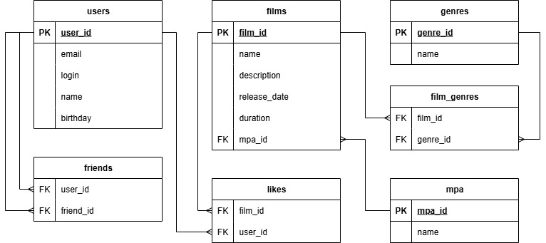

# java-filmorate
Template repository for Filmorate project.



# Примеры запросов:

### Получение всех фильмов:
```sql
SELECT  f.film_id,
        f.name, 
        f.description, 
        f.release_date, 
        f.duration,
        m.name,
        COUNT(l.user_id) AS likes_count
FROM films AS f
LEFT JOIN mpa AS m ON f.mpa_id=m.mpa_id
LEFT JOIN likes AS l ON f.film_id=l.film_id
GROUP BY f.film_id
ORDER BY likes_count DESC;
```

### Получение всех пользователей:
```sql
SELECT  u.user_id,
        u.name, 
        u.email,
        CAST(u.birthday AS date),
        COUNT(f.friend_id) AS friends_count
FROM users AS u
LEFT JOIN friends AS f ON u.user_id=f.user_id
WHERE f.confirmed=true
GROUP BY u.user_id
ORDER BY u.user_id;
```

### Топ 10 наиболее популярных фильмов:
```sql
SELECT  f.film_id,
        f.name, 
        f.description, 
        f.release_date, 
        f.duration,
        m.name,
        COUNT(l.user_id) AS likes_count
FROM films AS f
LEFT JOIN mpa AS m ON f.mpa_id=m.mpa_id
LEFT JOIN likes AS l ON f.film_id=l.film_id
GROUP BY f.film_id
ORDER BY likes_count DESC
LIMIT 10;
```

### Список общих друзей пользователей:
```sql
SELECT  u.user_id,
        u.name, 
        u.email,
        CAST(u.birthday AS date)
FROM users AS u
WHERE u.user_id IN (
    SELECT friend_id
    FROM friends
    WHERE user_id = 1 AND confirmed = true
    INTERSECT
    SELECT friend_id
    FROM friends
    WHERE user_id = 2 AND confirmed = true
)
ORDER BY u.user_id;
```